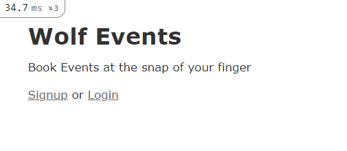
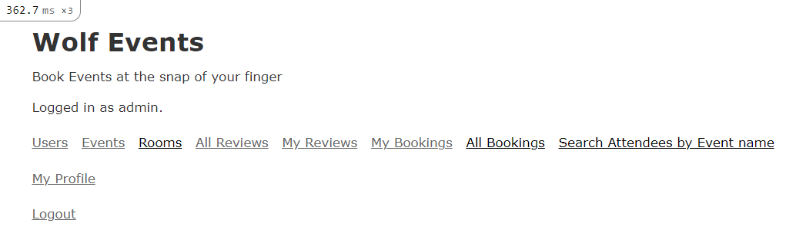
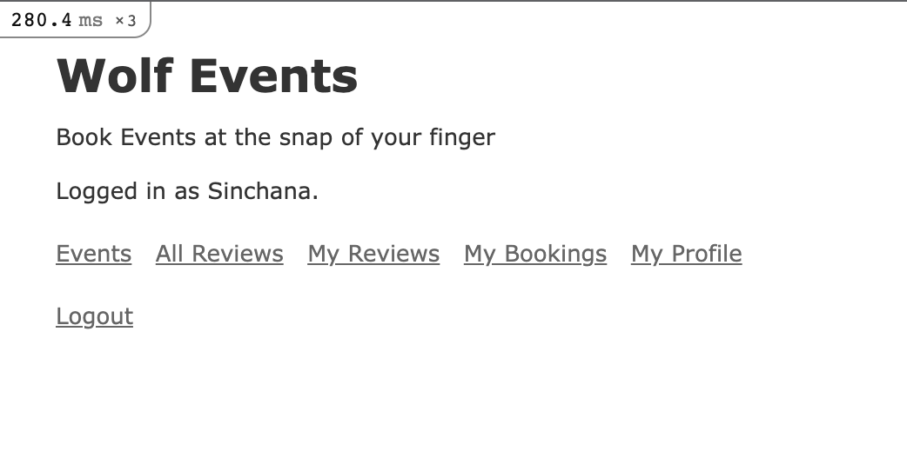

# WolfEvents

## Overview
WolfEvents is an Event Management System that serves as a comprehensive event ticketing platform. Users can browse and reserve event tickets, submit reviews, and maintain their profiles. Admin privileges encompass overseeing events, attendees, tickets, and reviews. This README provides essential information for navigating the application, including admin login credentials, system testing procedures, and utilization guidelines.

### Ruby Versions
This project utilizes Ruby version 3.3.2 and Rails version 6.1.7.

### Deployment
The application is deployed on NCSU VCL and can be accessed at: [WolfEvents](http://152.7.177.47:8080/)

## Preconfigured Admin
The seeds.rb file populates the database with initial data, including an Admin user, to facilitate testing and demonstration of features such as logging in as an admin, booking and canceling tickets, and writing reviews.

### Admin Credentials
- Email: admin@gmail.com
- Password: admin_password

## Navigating the Application
1. **Registration and Login**
    
    
    - To register as a new attendee, navigate to the Home page and select "Signup" to create your account. 
    - Utilize the created credentials to log in. 
    - Note: Admin registrations are not permitted. Instead, use the preconfigured admin login details provided.
    
    

2. **Edit Attendee Profile**
    - Upon logging in, access "My Profile" to modify details or "Delete Profile" to remove the account.
    - Admin can manage attendee accounts under the "Users" link.

3. **View Upcoming Events**
    - The Home page displays upcoming events under the "Events" section. 
    - Users can view future events with available seats.
    - Admin has unrestricted access to view, add, edit, or delete events.

4. **Search for Events**
    - Use the search bar on the Events Page to search by Category, Date, and Time.

5. **Book a Ticket**
    - Navigate to the "Events" page, select an event, and click "Buy ticket" to purchase tickets.

6. **Check Booking History**
    - Click on "My Bookings" on the Home page to view booked events.

7. **Write a Review**
    - Access "My Bookings" to review attended events. 
    - Users can write one review per event, with an option to edit.
    - Admin can edit or delete user reviews.

8. **List Reviews Written by You**
    - Use the "My Reviews" button on the Home page to list reviews written by you.

9. **List All Reviews**
    - Click on the "All Reviews" link to view all user reviews.
    - Use the search box to filter reviews by email or event.

10. **Logout**
    - Logout from your profile using the logout button on the Home page.

## Bonus Credits

11. **List attendee name when filtered by event name**
    - Once logged in as an admin, there's a feature to "Search Attendees by Event Name". Admins can filter attendees by entering the event name in the           search box. 
    - Alternatively, they can view all bookings under "All Bookings" to see the complete list of attendees for any event.
12. **Buy Tickets for Others** 
    - Navigate to the "Events" page, select an event, and click "Buy Ticket."
    - Choose between "Purchase for Self" or "Purchase for Others", where booking for others will be reflected in their history.

 
